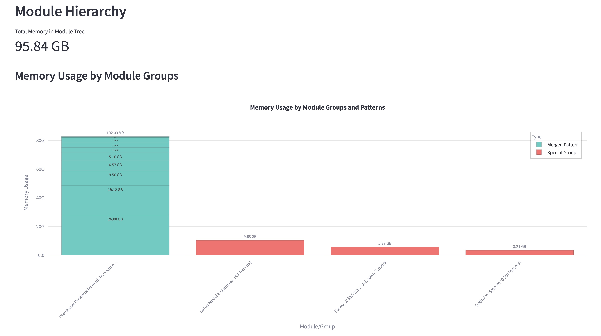
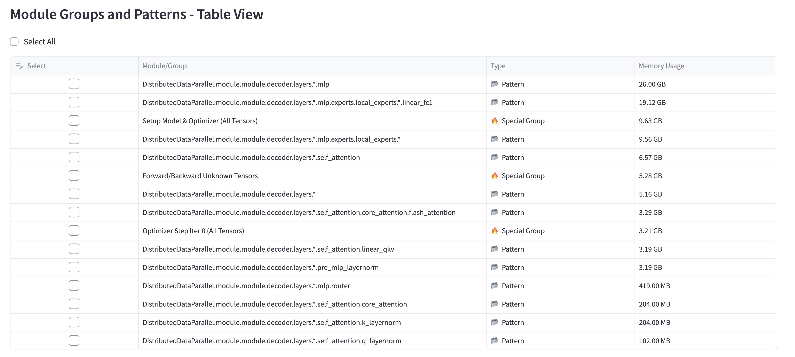
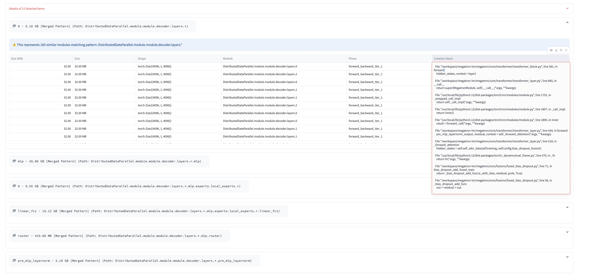

# PyTorch Memory Profiler

A utility library designed to estimate and analyze the memory footprint of PyTorch models, particularly for large models, often without requiring actual GPU resources. This tool leverages PyTorch's `FakeTensorMode` and `TorchDispatchMode` capabilities to simulate model execution and track estimated memory allocation.

## Features
*   **Memory Tracing with FakeTensor:** Estimate peak and current memory usage for model training steps (forward, backward, optimizer) using fake tensors without actual execution.
*   **Distributed Training Support:** Support distributed training memory tracer with one single process.
*   **Module-Level Tracking:** Pinpoint memory usage to specific modules within your model hierarchy using PyTorch hooks.
*   **Detailed Visualization Reporting:** Generate reports on peak/current memory, memory usage per module, memory usage across different training phases, and tensor creation statistics.
*   **Integration with Megatron-LM:** Seamless memory tracing your training scripts with minimal changes.

## Installation
```bash
# Clone the repository
git clone https://github.com/Victarry/PyTorch-Memory-Profiler.git
cd PyTorch-Memory-Profiler && pip install .
```

## Quick Start for Megatron-LM

Here's how to integrate memory tracing with Megatron-LM training:

### Megatron-LM setup
* **Method 1:** 
Clone the specific Megatron-LM branch for memory-tracing:
```bash
git clone https://github.com/Victarry/Megatron-LM.git
cd megatron-lm && git checkout denliu/patch_for_memory_tracing
```

* **Method 2:**
Apply the patch to your existing Megatron-LM installation:
```bash
cd YOUR_MEGATRON_PATH
git apply /path/to/PyTorch-Memory-Profiler/patches/memory_tracing_mcore.patch
```

### Memory tracing with existing training scripts

1. Enable memory tracing by adding the `--memory-tracing` flag to your existing Megatron-LM training command.
2. Set the `WORLD_SIZE` and `RANK` to specify the total number of GPUs and current rank ID.
3. [Optional] Set `--save-peak-memory-snapshot` to specify the location to save the peak memory snapshot. The snapshot is saved in JSON format, allowing you to directly inspect tensor information or use the provided visualizer.

Explore ./examples/megatron-lm for predefined scripts.

**Key points:**
- Training will automatically stop after 2 iterations when memory tracing is enabled.
- Mock data is used automatically, so no real dataset is required.
- The tool works with distributed training configurations (TP, PP, EP).
- Only one process is needed to launch for memory profiling; no `torchrun` is needed even for distributed training.
- Token-drop-and-pad training is forcibly applied for MoE training scripts.

After running, you can see the memory profiler results like below:
```
Peak Memory Changes in each phase:
--------------------------------------------------------------------------
Phase                     | Device | Before (MB) | After (MB) | Delta (MB)
--------------------------------------------------------------------------
setup_model_and_optimizer | cuda:0 | 0.00        | 36466.30   | 36466.30
forward_backward_iter_0   | cuda:0 | 36466.30    | 140969.36  | 104503.06
optimizer_step_iter_0     | cuda:0 | 140969.36   | 140969.36  | 0.00
forward_backward_iter_1   | cuda:0 | 140969.36   | 142789.21  | 1819.85
optimizer_step_iter_1     | cuda:0 | 142789.21   | 142789.21  | 0.00
--------------------------------------------------------------------------
```

The memory profiler displays the peak allocated memory during training. However, this value represents only the memory directly allocated by your training process. There are additional memory costs that are not tracked by this tool:

1. PyTorch's internal memory management (reserved memory)
2. System processes like NCCL for distributed training
3. CUDA runtime overhead
Keeping the max allocated memory below 70 GB is a relatively safe threshold.

### Visualization of peak memory snapshot

After running memory tracing, visualize the saved peak memory snapshot using the included Streamlit-based visualizer:

```bash
# Navigate to tools directory
cd PyTorch-Memory-Profiler/tools

# Install visualization dependencies
uv sync

# Launch the visualizer
uv run streamlit run visualizer.py -- --file /path/to/memory_snapshot.json
```

The visualizer provides several interactive views:

1. **Phase view**: Memory usage during different phases (e.g., set_model_and_optimizer, forward_backward, optimizer_step).
2. **Memory Cost grouped overview**: Similar modules (like transformer layers) grouped together.

3. **Table View**: Interactive table showing memory usage breakdown.

4. **Tensor Details**: Detailed information about individual tensors.


TODO: Provide a detailed explanation of the visualization items.

## Documentation

For more detailed usage instructions, see:
- [Custom Usage](docs/custom-usage.md) - Module tracking, phase tracking, and memory snapshot analysis

## TODO
- [ ] FP8 support in TransformerEngine

## Known Limitations & Considerations

*   **Estimation Accuracy:** The accuracy depends on PyTorch correctly reporting storage sizes for fake tensors and the dispatcher accurately reflecting real-world operations. Complex custom CUDA kernels might not be perfectly captured.
*   **Operator Coverage:** While common operations are handled, highly specialized or new PyTorch operations might require specific handling or patching via plugins if they interact poorly with `FakeTensorMode` or `TorchDispatchMode`.
*   **External Library Patching:** Relies on patching specific functions in external libraries. Updates to these libraries might break compatibility if function signatures or internal logic change significantly. The plugins attempt to handle missing libraries gracefully.
*   **Data-Dependent Operations:** Operations whose output shape or memory usage depends heavily on input *values* (not just shapes) are not supported with fake tensors (e.g., indexing with boolean masks).
*   **FP8 Support:** Currently, FP8 operations are not supported in memory tracing mode due to limitations in fake tensor handling.
